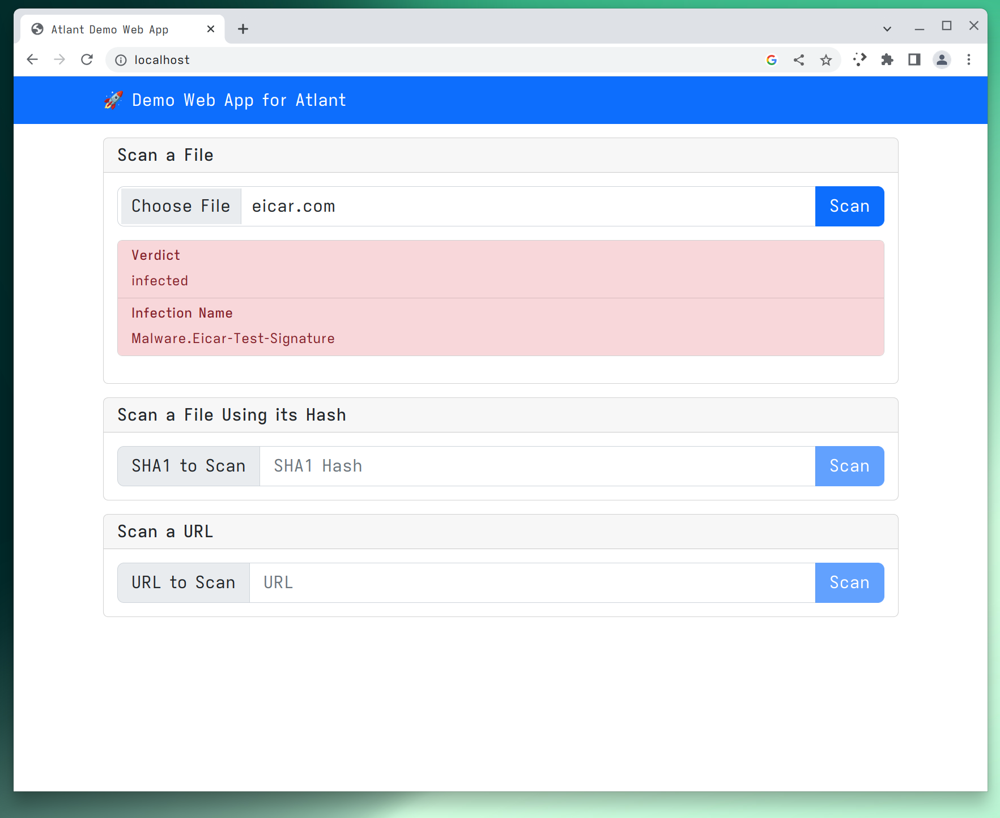

# Web Application Demo

This directory contains a simple web application that internally uses Atlant
container to perform various scanning and detection tasks.



## Structure of the Project

The web app has been structured as three containers:

[`demo-web-app-frontend`](demo-web-app-frontend) contains the frontend for the
web service. This is a simple web app built on top of React that allows users to
scan files and classify URLs to different content categories. The frontend is
served using NGINX which also acts as a reverse proxy for the backend.

[`demo-web-app-backend`](demo-web-app-backend) contains the Python based backend
for the service. This is a built on using FastAPI and employs
`asyncio-icap-client` for talking to Atlant in order to do scanning.

[`demo-web-app-atlant`](demo-web-app-atlant) container derives from the official
Atlant container bundling configuration into it.

## Getting Started

Before the project can be used, an Atlant license file or a subscription key is
required. The license needs to be included into `demo-web-app-atlant` container.
By default, the configuration file present in the container specifies that a
license file named `license.key` exists in container's
`/etc/opt/withsecure/atlant/config` directory. Place `license.key` file to the
`demo-web-app-atlant` directory to include it into the container. If you are
using a subscription key instead of a license file, modify the `config.json`
file inside `demo-web-app-atlant` directory accordingly.

Once you have specified the license, you can build and bring up the service
using [Docker compose](https://docs.docker.com/compose/):

```
# Build all the containers
docker compose build
# Bring up the service
docker compose up
```

> **Note**
> Be sure to use a recent enough version of Docker.

One the service is running you should be able to access the service by opening
`http://localhost` in your browser.
